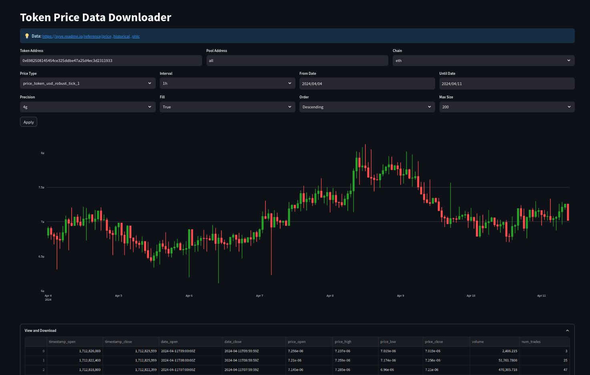

# Cryptocurrency OHLC DEX Price Data Viewer & Downloader

This repository provides a tool for viewing and downloading cryptocurrency price data. It uses **Streamlit** and **Plotly** with the ***Syve API** to create a dashboard. This dashboard shows an OHLC (Open, High, Low, Close) candlestick chart and a data table.

Supported blockchains are: Ethereum, Polygon, and Base. You can use it to plot OHLC data on over **300K+ tokens** traded on all the major DEXs across the supported chains.



## Getting started

To begin using the application, follow these steps:

1. Clone the repository to your local machine:

```
git clone git@github.com:syveai/ohlc-chart.git
```

2. Install the necessary Python requirements as listed in requirements.txt.

To do that, first create a Python virtual environment (if you haven't already) and activate it.

```
cd $REPO_DIR
python3 -m venv venv
source venv/bin/activate
pip install -r requirements.txt
```

3. Navigate to the repository directory and run the application using `streamlit`:

```
cd $REPO_DIR
streamlit run app.py
```

This application uses the Syve API (https://www.syve.ai) to obtain OHLC (Open, High, Low, Close) price data for rendering the charts. An API key from Syve is required for this functionality.

If you do not have an API key, you can obtain one at no cost. Contact the amdins on Discord to request a **free** API key: https://discord.com/invite/rs5GPAZ7tG

The first time you run the application, you will be asked to enter your Syve API key. After entering your key, it will be stored in `data/config.json` for future use.
